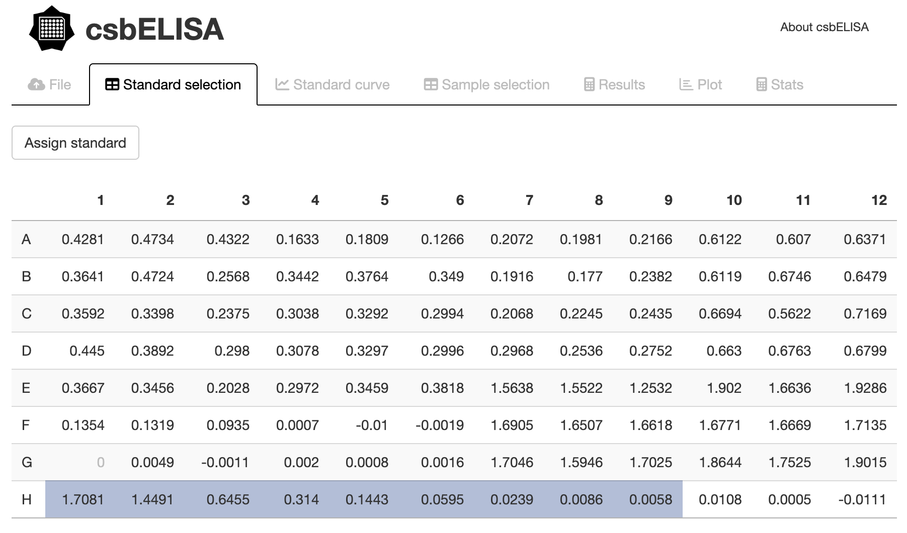
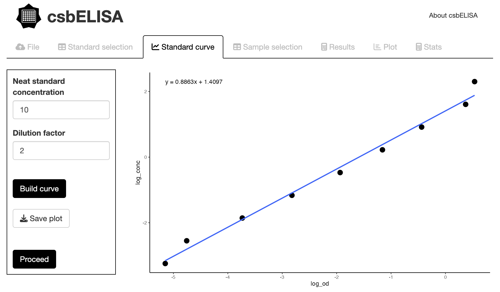
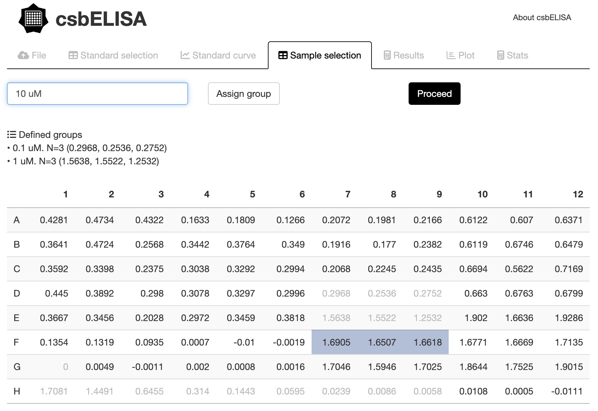
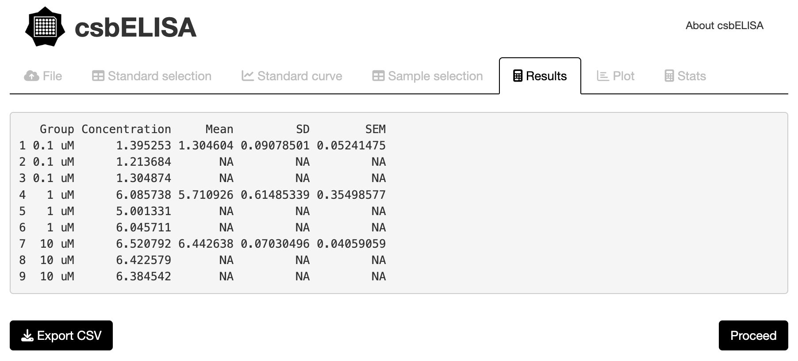
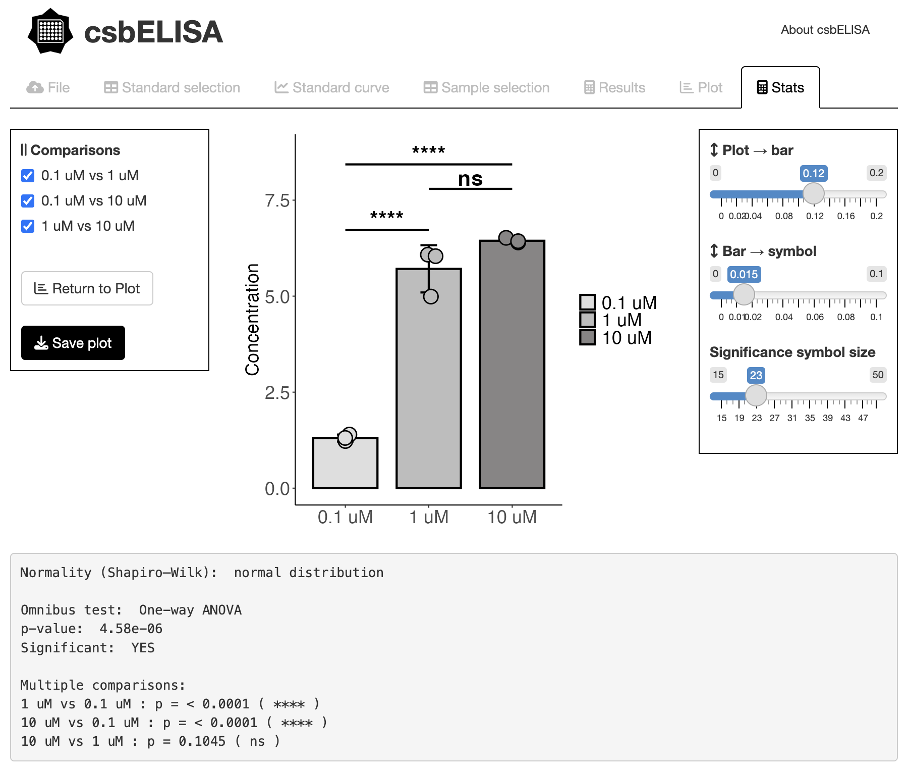

<!-- README.md is generated from README.Rmd. Please edit that file -->

# csbELISA 

<!-- badges: start -->
<!-- badges: end -->

**csbELISA** is an open-source project that provides a user-friendly,
interactive interface for automated ELISA data processing, including
standard curve fitting, concentration estimation, visualization, and
statistical analysis.

## Installation

**csbELISA** can be installed by first installing R and typing the following
commands in the R console:

``` r
# to allow installation of GitHub packages
install.packages("devtools")

# csbELISA can then be installed
devtools::install_github("BonilhaCaio/csbELISA")
```

## Usage

**csbELISA** Shiny-based user interface with all its tools is generated through
the package's single function:

``` r
csbELISA::runCsbELISA()
```

## User Guide

**csbELISA** is launched as an interactive Shiny application for
automated ELISA data processing, visualization, and statistical
analysis.

The workflow is organized into sequential tabs that guide the user from
raw data import to concentration estimation and statistical inference.

-   The application opens in the *File* tab, where the user uploads a
    `.csv` file containing ELISA optical density (OD) values arranged in
    plate format. Once the file is loaded, the data are parsed and made
    available for downstream processing.

-   In the *Standard selection* tab, the user defines blank and standard
    wells by directly selecting cells from the table. Blank values are
    subtracted automatically, and standard wells are ordered internally
    to construct the standard curve.



-   The *Standard curve* tab enables fitting of the calibration curve.
    Users specify the neat standard concentration and dilution factor,
    after which a linear model is fitted on log-transformed data. The
    fitted curve and equation are displayed and can be exported for
    record keeping.

<center>

</center>

-   In the *Sample selection* tab, experimental samples are grouped by
    selecting wells directly from the plate layout. Selected wells are
    locked to prevent reassignment, and defined groups are displayed in a
    summary panel prior to analysis.



-   The *Results* tab reports calculated concentrations for all samples
    based on the fitted standard curve. Group-wise means, standard
    deviations, and standard errors are computed automatically, and the
    full results table can be exported as a `.csv` file.

<center>

</center>

-   Data visualization is performed in the *Plot* tab, where results can
    be displayed as bar plots or box plots. Users can customize error
    bars (SD or SEM), adjust plot dimensions, rotate axis labels, display
    individual data points, and assign custom colors to each group.

<center>

</center>

-   Statistical analysis is carried out in the *Stats* tab. Depending on
    data normality and the number of groups, csbELISA automatically
    applies the appropriate statistical tests (t-test, Wilcoxon test,
    one-way ANOVA, Kruskal–Wallis), followed by adjusted post-hoc
    comparisons when applicable. Significance levels are displayed both
    graphically and as a detailed textual summary.

<center>

</center>

## Credits and citation

A publication where the package dependencies and imports will be appropriately
credited is on the way. Meanwhile, you can cite **csbELISA** as follows:

``` r
citation("csbELISA")
```
